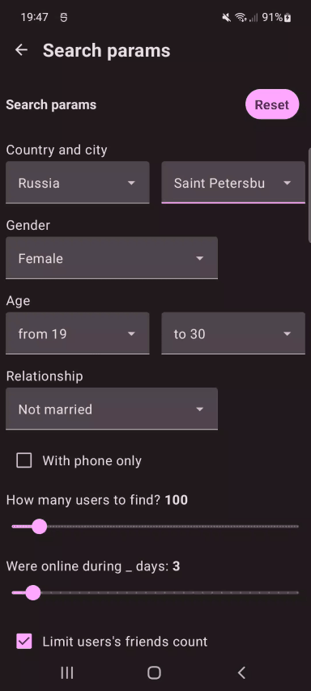

In Search App
==================

**InSearch** is a **work-in-progress** Android app, which connects to [VK.com](https://dev.vk.com/reference).

# Features

**InSearch** is a parsing (scrapping) app which allows to search users within VK.com social network, providing some additional search parameters, which are not provided by default with VK API (such as "with phone only", "user was online during _ days" params, etc.). Performed searches are stored at local DB, so user could access them later at Search History screen.

# Android development
**InSearch** is still under development (might be some UI changes and performance optimizations in the future to make UX more friendly and smooth), but it already has all main features realized, with domain and data architecture layers fully completed.
**InSearch** is an app that attempts to use the latest libraries and tools. As a summary:

 * Entirely written in [Kotlin](https://kotlinlang.org/).
 * UI completely written in [Jetpack Compose](https://developer.android.com/jetpack/compose) (see below).
 * Uses [Kotlin Coroutines](https://kotlinlang.org/docs/reference/coroutines/coroutines-guide.html) throughout.
 * Uses many of the [Architecture Components](https://developer.android.com/topic/libraries/architecture/), including: Room, Lifecycle, Navigation.
 * Uses [Hilt](https://dagger.dev/hilt/) for dependency injection

# Screenshots

### Search process

### Search params

### Search history

# Architecture

The **InSearch** app follows the
[official architecture guidance](https://developer.android.com/topic/architecture) 

# Modularization

The **InSearch** app has been fully modularized.